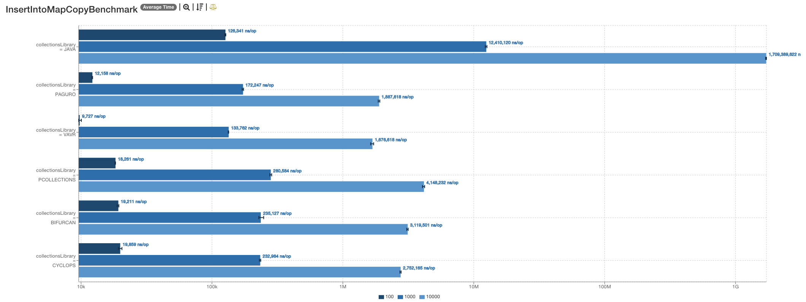
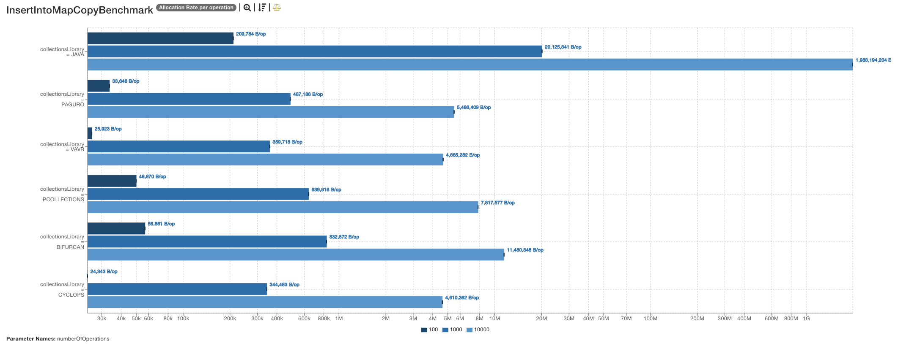

# Reasons to Use vavr

## Clear API for Immutable and Thread-Safe Collections
VAVR provides a clear API for immutable and thread-safe collections such as `List`, `Set`, `Map`, and `Queue`. These collections are immutable and persistent, ensuring that data cannot be modified once created, which makes them inherently thread-safe.
By leveraging VAVR's functional programming constructs and immutable data structures, you can write more concise and expressive code. This often leads to better readability and maintainability, as the code becomes easier to understand and reason about. The reduction in boilerplate code also means fewer opportunities for bugs and errors.

### Example: Thread Safety and Immutability
Is the below code thread-safe? Will it break? Is it a pure function?
```java
public void append(java.util.List<Integer> intList1, java.util.List<Integer> intList2) {
    intList1.addAll(intList2);
    return;
}
```
The answers are: Maybe, Maybe, No.

Ever had `ConcurrentModificationException` thrown at you? If the same list was passed to another method that runs on a different thread, and it's not one of the thread-safe collections, you're out of luck.

Ever used `java.util.List.of()` method? Everybody did. But what happens when you pass it to the above method? You get `UnsupportedOperationException`.

So how do you safely add items to a Java list? You create a mutable list from a list, modify it, and return it. That is, if you want it to be mutable from now on.

VAVR collections are always immutable and thread-safe.

### VAVR Example
```java
public List<Integer> main(List<Integer> list1, List<Integer> list2) {
    return list1.appendAll(list2);
}
```

## Functional Programming with Monads
VAVR supports several monads such as `Option`, `Try`, `Either`, `Future`, `Tuple`, and `Validation`. Monads are a way to handle errors, nulls, and side effects in a functional way. They are containers for data or functions that can be chained together to form a pipeline of operations.

### Descriptions
- **Option**: Represents an optional value (either `Some` or `None`), reducing the need for null checks.
- **Try**: Encapsulates a computation that may result in an exception, providing a way to handle errors without using try-catch blocks.
- **Either**: Represents a value of two possible types, often used for error handling where one type is for success and the other for failure.
- **Lazy**: Represents a lazily evaluated value, which is computed only once and cached for subsequent access.
- **Tuple**: Represents a fixed-size collection of elements, providing a way to group values together.

More on the benefits of functional programming with monads can be found [here](https://blog.shangjiaming.com/vavr-introduction/).

## Pattern Matching
Pattern matching is a powerful feature of functional programming languages that allows you to match a value against a pattern and execute code based on the match. This allows for more readable and concise code when dealing with complex data structures and control flow.

### Traditional Java
```java
String result;
switch (value) {
  case 1:
  case 2:
  case 3:
    result = "one, two or three";
    break;
  case 4:
    result = "four";
    break;
  default:
    result = "other";
}
```

### VAVR Example
```java
String result = Match(value).of(
    Case($(isIn(1, 2, 3)), "one, two or three"),
    Case($(4), "four"),
    Case($(), "other"));
```

## Functions as first class citizens
VAVR extends Java's functional interfaces with additional methods and utilities, making it easier to work with functions, tuples, and higher-order functions.
It also provides interfaces for functions with multiple arguments, such as Function3, Function4, etc.

```java
public static int square(int a) {
  return a * b;
}
Function<Integer, Integer> squareFunction = Calculations::square;

public static int sum(int a, int b) {
    return a + b;
}
BiFunction<Integer, Integer, Integer> sumFunction = Calculations::sum;

public static int sumAll(int a, int b, int c) {
  return a + b + c;
}

//whoops? vavr to the rescue
Function3<Integer, Integer, Integer, Integer> sumAllFunction = Calculations::sumAll;
```

## Library is well optimized
It takes after Scala's functional programming library and is well optimized for performance.
Example benchmarks for map:



[More on performance](https://tech.ringieraxelspringer.com/blog/programming/cause-i-remember-everything-measuring-performance-of-persistent-collections-for-java/dl82jz8)
